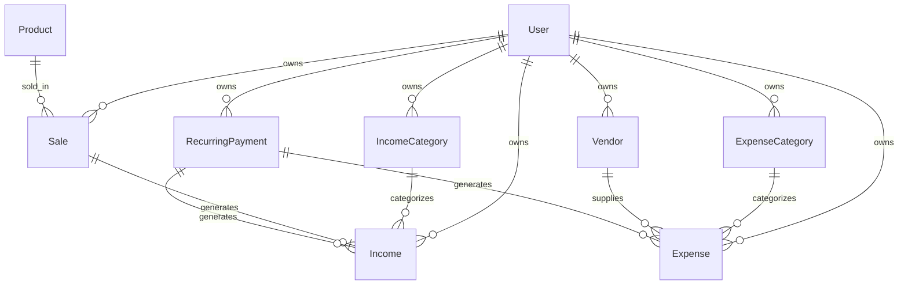

# Design Document

## Overview

The Financial Inventory Tracker is a comprehensive system that integrates financial management with inventory tracking. It provides users with the ability to record income and expenses, manage categories and vendors, set up recurring payments, and automatically synchronize inventory levels with sales transactions. The system is built on the existing Next.js/React architecture with MongoDB as the database backend.

## Architecture

### System Architecture
The system follows a layered architecture pattern:

```
┌─────────────────────────────────────────┐
│           Presentation Layer            │
│  (React Components, Forms, Tables)      │
├─────────────────────────────────────────┤
│            API Layer                    │
│     (Next.js API Routes)                │
├─────────────────────────────────────────┤
│          Business Logic Layer           │
│   (Services, Utilities, Validators)     │
├─────────────────────────────────────────┤
│           Data Access Layer             │
│      (Mongoose Models, Schemas)         │
├─────────────────────────────────────────┤
│            Database Layer               │
│           (MongoDB)                     │
└─────────────────────────────────────────┘
```

### Integration Points
- **Existing Product System**: Leverages the current Product model for inventory management
- **User Authentication**: Integrates with existing User model for data ownership
- **Navigation System**: Extends the current MenuItems configuration
- **UI Components**: Utilizes existing Material-UI component library

## Components and Interfaces

### Database Models

#### IncomeCategory Model
```typescript
interface IIncomeCategory {
  name: string;
  description?: string;
  isDefault: boolean;
  userId: string; // Reference to User
  createdAt: Date;
  updatedAt: Date;
}
```

#### ExpenseCategory Model
```typescript
interface IExpenseCategory {
  name: string;
  description?: string;
  isDefault: boolean;
  userId: string; // Reference to User
  createdAt: Date;
  updatedAt: Date;
}
```

#### Vendor Model
```typescript
interface IVendor {
  name: string;
  contactEmail?: string;
  contactPhone?: string;
  address?: string;
  notes?: string;
  userId: string; // Reference to User
  createdAt: Date;
  updatedAt: Date;
}
```

#### Income Model
```typescript
interface IIncome {
  amount: number;
  description: string;
  date: Date;
  categoryId: string; // Reference to IncomeCategory
  saleId?: string; // Optional reference to Sale
  isRecurring: boolean;
  recurringPaymentId?: string; // Reference to RecurringPayment
  userId: string; // Reference to User
  createdAt: Date;
  updatedAt: Date;
}
```

#### Expense Model
```typescript
interface IExpense {
  amount: number;
  description: string;
  date: Date;
  categoryId?: string; // Reference to ExpenseCategory
  vendorId?: string; // Reference to Vendor
  isRecurring: boolean;
  recurringPaymentId?: string; // Reference to RecurringPayment
  userId: string; // Reference to User
  createdAt: Date;
  updatedAt: Date;
}
```

#### Sale Model
```typescript
interface ISale {
  productId: string; // Reference to Product
  quantity: number;
  unitPrice: number;
  totalAmount: number;
  date: Date;
  notes?: string;
  userId: string; // Reference to User
  createdAt: Date;
  updatedAt: Date;
}
```

#### RecurringPayment Model
```typescript
interface IRecurringPayment {
  type: 'income' | 'expense';
  amount: number;
  description: string;
  frequency: 'daily' | 'weekly' | 'monthly' | 'yearly';
  startDate: Date;
  endDate?: Date;
  nextDueDate: Date;
  isActive: boolean;
  categoryId?: string; // Reference to IncomeCategory or ExpenseCategory
  vendorId?: string; // Reference to Vendor (for expenses)
  userId: string; // Reference to User
  createdAt: Date;
  updatedAt: Date;
}
```

### API Endpoints

#### Income Management
- `GET /api/finance/income` - List user's income records
- `POST /api/finance/income` - Create new income record
- `PUT /api/finance/income/[id]` - Update income record
- `DELETE /api/finance/income/[id]` - Delete income record

#### Expense Management
- `GET /api/finance/expenses` - List user's expense records
- `POST /api/finance/expenses` - Create new expense record
- `PUT /api/finance/expenses/[id]` - Update expense record
- `DELETE /api/finance/expenses/[id]` - Delete expense record

#### Sales Management
- `GET /api/finance/sales` - List user's sales records
- `POST /api/finance/sales` - Create new sale (with inventory update)
- `PUT /api/finance/sales/[id]` - Update sale record
- `DELETE /api/finance/sales/[id]` - Delete sale record

#### Category Management
- `GET /api/finance/categories/income` - List income categories
- `POST /api/finance/categories/income` - Create income category
- `GET /api/finance/categories/expense` - List expense categories
- `POST /api/finance/categories/expense` - Create expense category

#### Vendor Management
- `GET /api/finance/vendors` - List vendors
- `POST /api/finance/vendors` - Create vendor
- `PUT /api/finance/vendors/[id]` - Update vendor
- `DELETE /api/finance/vendors/[id]` - Delete vendor

#### Recurring Payments
- `GET /api/finance/recurring` - List recurring payments
- `POST /api/finance/recurring` - Create recurring payment
- `PUT /api/finance/recurring/[id]` - Update recurring payment
- `DELETE /api/finance/recurring/[id]` - Delete recurring payment
- `POST /api/finance/recurring/process` - Process due recurring payments

### React Components

#### Page Components
- `FinanceDashboard` - Main financial overview page
- `IncomeList` - Income records listing and management
- `ExpenseList` - Expense records listing and management
- `SalesList` - Sales records listing and management
- `CategoryManagement` - Income/expense category management
- `VendorManagement` - Vendor management interface
- `RecurringPayments` - Recurring payment setup and management

#### Form Components
- `IncomeForm` - Income entry form
- `ExpenseForm` - Expense entry form
- `SaleForm` - Sale registration form
- `CategoryForm` - Category creation/editing form
- `VendorForm` - Vendor creation/editing form
- `RecurringPaymentForm` - Recurring payment setup form

#### Utility Components
- `FinancialSummaryCard` - Summary statistics display
- `TransactionTable` - Reusable transaction listing table
- `CategorySelector` - Category selection dropdown
- `VendorSelector` - Vendor selection dropdown
- `ProductSelector` - Product selection for sales

## Data Models

### Database Schema Design

#### Relationships


#### Default Data Population
The system will pre-populate default categories:

**Income Categories:**
- Product Sales
- Service Fees
- Commissions
- Other Income

**Expense Categories:**
- Rent
- Utilities
- Advertising
- Shipping
- Salaries
- Equipment

### Data Validation Rules
- All monetary amounts must be positive numbers
- Dates cannot be in the future (except for recurring payment schedules)
- Category names must be unique per user
- Vendor names must be unique per user
- Sale quantities cannot exceed available inventory
- Recurring payment frequencies must be valid enum values

## Error Handling

### API Error Responses
```typescript
interface ApiError {
  success: false;
  error: {
    code: string;
    message: string;
    details?: any;
  };
}
```

### Error Categories
1. **Validation Errors** (400)
   - Invalid input data
   - Missing required fields
   - Data format errors

2. **Business Logic Errors** (422)
   - Insufficient inventory for sale
   - Duplicate category names
   - Invalid date ranges

3. **Authentication Errors** (401)
   - Invalid or expired tokens
   - Unauthorized access attempts

4. **Not Found Errors** (404)
   - Non-existent resources
   - Deleted records

5. **Server Errors** (500)
   - Database connection issues
   - Unexpected system errors

### Client-Side Error Handling
- Form validation with real-time feedback
- Toast notifications for API errors
- Graceful degradation for network issues
- Retry mechanisms for failed requests

## Testing Strategy

### Unit Testing
- **Model Tests**: Validate schema definitions and business logic
- **API Route Tests**: Test endpoint functionality and error handling
- **Component Tests**: Test React component rendering and interactions
- **Utility Function Tests**: Test calculation and validation functions

### Integration Testing
- **Database Integration**: Test model interactions with MongoDB
- **API Integration**: Test complete request/response cycles
- **Authentication Integration**: Test user-specific data access
- **Inventory Integration**: Test sales-inventory synchronization

### End-to-End Testing
- **User Workflows**: Test complete user journeys
- **Cross-Feature Integration**: Test interactions between different modules
- **Data Consistency**: Test data integrity across operations

### Test Data Management
- **Fixtures**: Pre-defined test data sets
- **Factories**: Dynamic test data generation
- **Cleanup**: Automated test data cleanup procedures

## Performance Considerations

### Database Optimization
- **Indexing Strategy**:
  - User-based indexes for data isolation
  - Date-based indexes for time-series queries
  - Category and vendor indexes for filtering
  - Compound indexes for complex queries

- **Query Optimization**:
  - Pagination for large data sets
  - Aggregation pipelines for summary data
  - Selective field projection
  - Connection pooling

### Caching Strategy
- **API Response Caching**: Cache category and vendor lists
- **Client-Side Caching**: Cache frequently accessed data
- **Database Query Caching**: Implement query result caching

### Real-time Updates
- **Optimistic Updates**: Update UI immediately, sync with server
- **Event-Driven Updates**: Use WebSocket for real-time notifications
- **Batch Processing**: Group recurring payment processing

## Security Considerations

### Data Protection
- **User Data Isolation**: Ensure users can only access their own data
- **Input Sanitization**: Validate and sanitize all user inputs
- **SQL Injection Prevention**: Use parameterized queries
- **XSS Prevention**: Sanitize output data

### Authentication & Authorization
- **JWT Token Validation**: Verify tokens on all protected routes
- **Role-Based Access**: Implement user role checking
- **Session Management**: Secure session handling
- **Rate Limiting**: Prevent API abuse

### Financial Data Security
- **Encryption**: Encrypt sensitive financial data
- **Audit Logging**: Log all financial transactions
- **Data Backup**: Regular automated backups
- **Compliance**: Follow financial data protection standards

## Navigation Integration

### Menu Structure
The system will add a new "Finance" section to the existing menu:

```typescript
{
  navlabel: true,
  subheader: "Finance",
},
{
  id: uniqueId(),
  title: "Dashboard",
  icon: IconChartLine,
  href: "/finance/dashboard",
},
{
  id: uniqueId(),
  title: "Income",
  icon: IconCurrencyDollar,
  href: "/finance/income",
},
{
  id: uniqueId(),
  title: "Expenses",
  icon: IconReceipt,
  href: "/finance/expenses",
},
{
  id: uniqueId(),
  title: "Sales",
  icon: IconShoppingCart,
  href: "/finance/sales",
},
{
  id: uniqueId(),
  title: "Categories",
  icon: IconCategory,
  href: "/finance/categories",
},
{
  id: uniqueId(),
  title: "Vendors",
  icon: IconBuilding,
  href: "/finance/vendors",
},
{
  id: uniqueId(),
  title: "Recurring",
  icon: IconRepeat,
  href: "/finance/recurring",
}
```

### Route Structure
```
/finance/
├── dashboard/          # Financial overview and analytics
├── income/            # Income management
├── expenses/          # Expense management
├── sales/             # Sales management
├── categories/        # Category management
├── vendors/           # Vendor management
└── recurring/         # Recurring payment management
```

## Deployment Considerations

### Environment Variables
```env
# Existing MongoDB connection
MONGODB_URI=mongodb://localhost:27017/boami

# Recurring payment processing
RECURRING_PAYMENT_CRON_SCHEDULE=0 0 * * *

# Financial data encryption
FINANCIAL_DATA_ENCRYPTION_KEY=your-encryption-key
```

### Database Migration
- Create migration scripts for new collections
- Populate default categories during initial setup
- Handle existing user data gracefully

### Monitoring & Logging
- Financial transaction logging
- Performance monitoring for financial queries
- Error tracking for payment processing
- Audit trails for data modifications