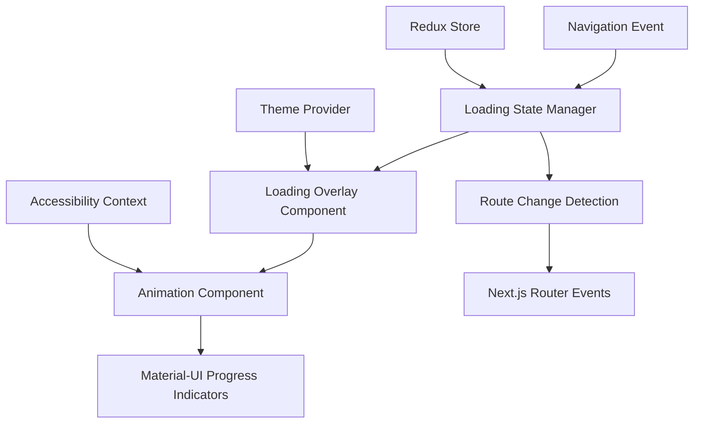
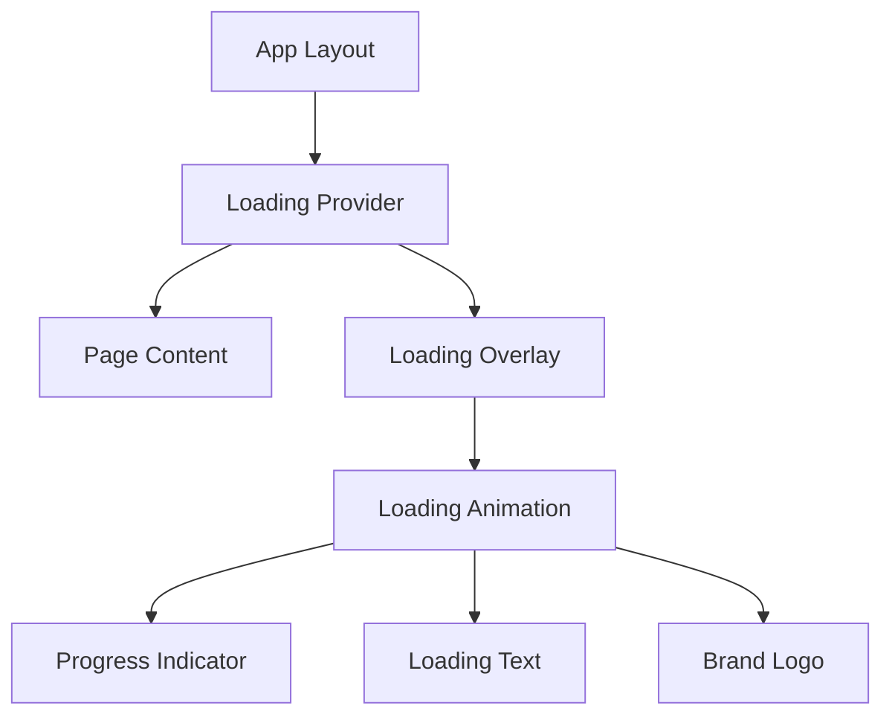

# Design Document

## Overview

The page loading animation feature will provide smooth visual feedback during page transitions in the Next.js 14 application. The system will leverage Next.js's built-in navigation events and React's state management to display loading indicators that match the application's Material-UI design system.

The solution will be implemented as a global loading overlay that appears during route transitions, with configurable animations and proper accessibility support. The design builds upon the existing loading.tsx component and integrates with the current Redux-based state management system.

## Architecture

### High-Level Architecture



### Component Hierarchy



## Components and Interfaces

### 1. Loading Provider Component

**Purpose**: Global provider that manages loading state and wraps the entire application.

**Location**: `src/app/components/shared/loading/LoadingProvider.tsx`

**Props Interface**:
```typescript
interface LoadingProviderProps {
  children: React.ReactNode;
  config?: LoadingConfig;
}

interface LoadingConfig {
  minDisplayTime?: number; // Default: 200ms
  maxDisplayTime?: number; // Default: 5000ms
  animationType?: 'circular' | 'linear' | 'dots' | 'pulse';
  showLogo?: boolean;
  showText?: boolean;
  customText?: string;
  fadeOutDuration?: number; // Default: 150ms
}
```

**Key Features**:
- Listens to Next.js router events
- Manages loading state with minimum display time
- Provides loading context to child components
- Handles accessibility announcements

### 2. Loading Overlay Component

**Purpose**: Full-screen overlay that displays during page transitions.

**Location**: `src/app/components/shared/loading/LoadingOverlay.tsx`

**Props Interface**:
```typescript
interface LoadingOverlayProps {
  isVisible: boolean;
  config: LoadingConfig;
  onAnimationComplete?: () => void;
}
```

**Key Features**:
- Full-screen backdrop with blur effect
- Smooth fade in/out animations using Framer Motion
- Responsive design for all screen sizes
- Z-index management to appear above all content

### 3. Loading Animation Component

**Purpose**: Animated loading indicator with multiple animation types.

**Location**: `src/app/components/shared/loading/LoadingAnimation.tsx`

**Props Interface**:
```typescript
interface LoadingAnimationProps {
  type: 'circular' | 'linear' | 'dots' | 'pulse';
  size?: 'small' | 'medium' | 'large';
  color?: 'primary' | 'secondary' | 'inherit';
  showLogo?: boolean;
  showText?: boolean;
  text?: string;
}
```

**Animation Types**:
- **Circular**: Material-UI CircularProgress with custom styling
- **Linear**: Animated progress bar with indeterminate state
- **Dots**: Three bouncing dots animation
- **Pulse**: Pulsing logo/icon animation

### 4. Loading Context

**Purpose**: React context for managing global loading state.

**Location**: `src/app/components/shared/loading/LoadingContext.tsx`

**Context Interface**:
```typescript
interface LoadingContextType {
  isLoading: boolean;
  setLoading: (loading: boolean) => void;
  config: LoadingConfig;
  updateConfig: (config: Partial<LoadingConfig>) => void;
}
```

### 5. Loading Hook

**Purpose**: Custom hook for components to interact with loading state.

**Location**: `src/hooks/useLoading.ts`

**Hook Interface**:
```typescript
interface UseLoadingReturn {
  isLoading: boolean;
  startLoading: () => void;
  stopLoading: () => void;
  setConfig: (config: Partial<LoadingConfig>) => void;
}
```

## Data Models

### Loading State Model

```typescript
interface LoadingState {
  isActive: boolean;
  startTime: number | null;
  minDisplayTime: number;
  currentRoute: string | null;
  previousRoute: string | null;
  animationType: AnimationType;
}

type AnimationType = 'circular' | 'linear' | 'dots' | 'pulse';
```

### Configuration Model

```typescript
interface LoadingConfiguration {
  global: {
    enabled: boolean;
    minDisplayTime: number;
    maxDisplayTime: number;
    fadeOutDuration: number;
  };
  animation: {
    type: AnimationType;
    size: 'small' | 'medium' | 'large';
    color: string;
  };
  content: {
    showLogo: boolean;
    showText: boolean;
    customText?: string;
  };
  accessibility: {
    announceNavigation: boolean;
    respectMotionPreferences: boolean;
  };
}
```

## Error Handling

### Loading Timeout Handling

```typescript
interface LoadingTimeoutHandler {
  maxTimeout: number; // 5 seconds default
  onTimeout: () => void;
  fallbackAction: 'hide' | 'show-error' | 'retry';
}
```

**Error Scenarios**:
1. **Navigation Timeout**: If loading exceeds maxDisplayTime, show error state or hide loading
2. **Route Resolution Failure**: Handle failed navigation attempts gracefully
3. **Animation Errors**: Fallback to simple loading indicator if complex animations fail
4. **Context Provider Missing**: Graceful degradation when LoadingProvider is not available

### Error Recovery Strategies

1. **Graceful Degradation**: Fall back to browser's default loading behavior
2. **Retry Mechanism**: Attempt to re-initialize loading system on failure
3. **User Feedback**: Show appropriate error messages for navigation failures
4. **Logging**: Comprehensive error logging for debugging

## Testing Strategy

### Unit Tests

**Components to Test**:
- LoadingProvider: State management and router event handling
- LoadingOverlay: Visibility and animation behavior
- LoadingAnimation: Different animation types and configurations
- useLoading hook: State updates and side effects

**Test Scenarios**:
```typescript
describe('LoadingProvider', () => {
  test('shows loading on route change start');
  test('hides loading on route change complete');
  test('respects minimum display time');
  test('handles rapid navigation changes');
  test('cleans up event listeners on unmount');
});

describe('LoadingOverlay', () => {
  test('renders with correct z-index');
  test('applies fade animations correctly');
  test('responds to visibility prop changes');
  test('handles accessibility attributes');
});
```

### Integration Tests

**Navigation Flow Tests**:
- Test complete navigation cycle with loading states
- Verify loading behavior with different route types
- Test browser back/forward button integration
- Validate loading state during programmatic navigation

**Performance Tests**:
- Measure loading animation performance impact
- Test memory usage during rapid navigation
- Validate smooth animations on different devices

### Accessibility Tests

**Screen Reader Tests**:
- Verify loading announcements
- Test focus management during loading
- Validate ARIA attributes and roles

**Motion Preference Tests**:
- Test reduced motion preferences
- Verify animation disabling for accessibility

## Implementation Phases

### Phase 1: Core Loading System
- Implement LoadingProvider and context
- Create basic LoadingOverlay component
- Add router event listeners
- Implement minimum display time logic

### Phase 2: Animation Components
- Create LoadingAnimation component with multiple types
- Implement Framer Motion animations
- Add responsive design support
- Integrate with Material-UI theme system

### Phase 3: Configuration and Customization
- Add configuration options
- Implement useLoading hook
- Create configuration management system
- Add theme integration

### Phase 4: Accessibility and Polish
- Implement accessibility features
- Add motion preference support
- Optimize performance
- Add comprehensive error handling

### Phase 5: Integration and Testing
- Integrate with existing app structure
- Update layout components
- Add comprehensive test coverage
- Performance optimization and debugging

## Technical Considerations

### Performance Optimizations

1. **Lazy Loading**: Load animation components only when needed
2. **Memoization**: Use React.memo for animation components
3. **Event Debouncing**: Prevent rapid loading state changes
4. **CSS Animations**: Use CSS transforms for better performance

### Browser Compatibility

- Support for modern browsers with ES2020+ features
- Graceful degradation for older browsers
- CSS animation fallbacks for unsupported features

### Mobile Considerations

- Touch-friendly loading indicators
- Responsive sizing for different screen densities
- Optimized animations for mobile performance
- Battery usage considerations

### SEO and SSR Considerations

- Server-side rendering compatibility
- No impact on initial page load SEO metrics
- Proper hydration handling
- Meta tag preservation during navigation