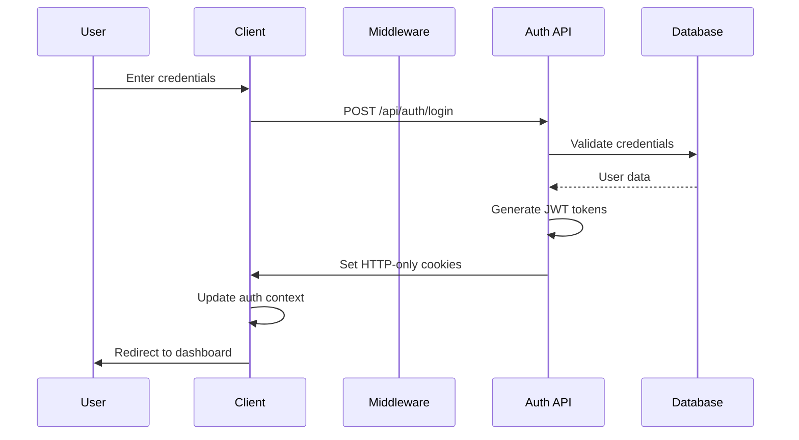
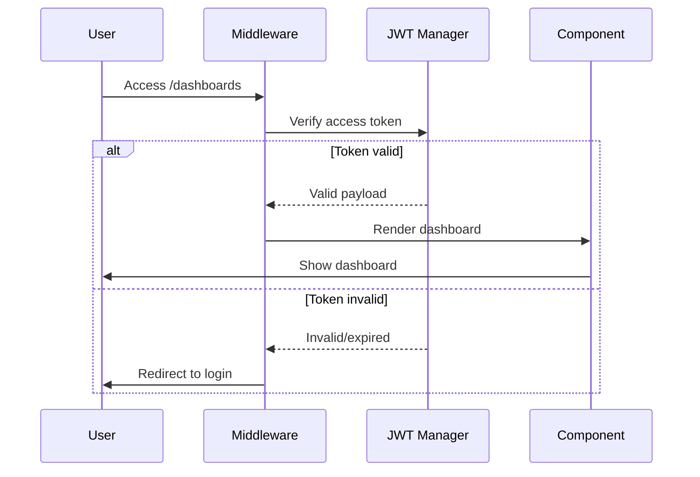
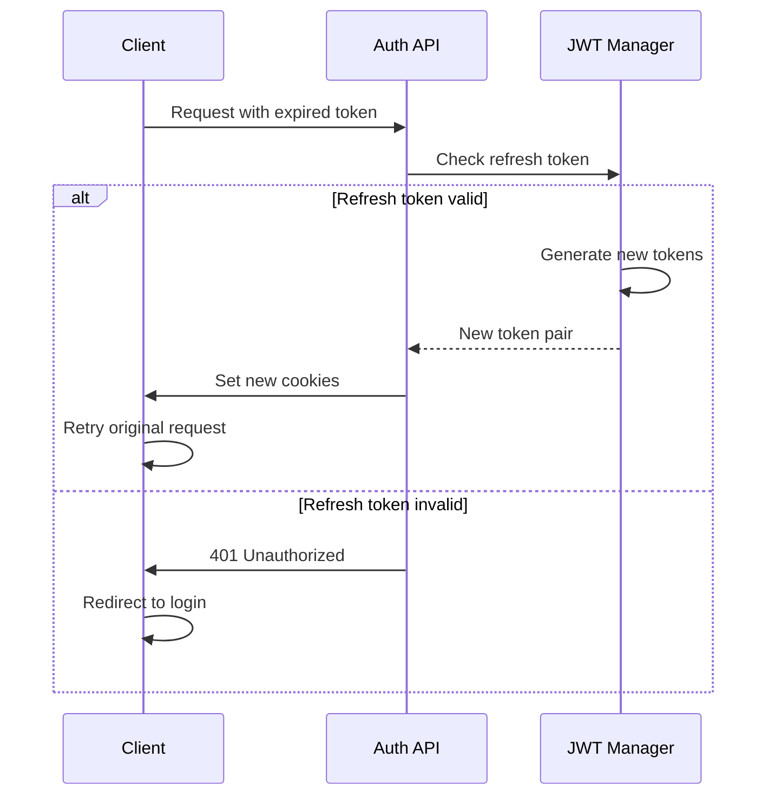

# Authentication System Documentation

## Overview

This document provides comprehensive documentation for the BOAMI authentication system, including architecture, implementation details, security features, and troubleshooting guides.

## Table of Contents

1. [Architecture Overview](#architecture-overview)
2. [Authentication Flow](#authentication-flow)
3. [Security Features](#security-features)
4. [API Documentation](#api-documentation)
5. [Component Usage](#component-usage)
6. [Configuration](#configuration)
7. [Troubleshooting](#troubleshooting)
8. [Best Practices](#best-practices)
9. [Performance Optimization](#performance-optimization)
10. [Testing](#testing)

## Architecture Overview

The authentication system is built with a layered architecture providing comprehensive security and user experience:

```
┌─────────────────────────────────────────────────────────────┐
│                    Client Layer                             │
├─────────────────────────────────────────────────────────────┤
│  React Components  │  Auth Context  │  Loading States      │
├─────────────────────────────────────────────────────────────┤
│                  Middleware Layer                           │
├─────────────────────────────────────────────────────────────┤
│  Route Protection  │  JWT Validation │  Security Headers   │
├─────────────────────────────────────────────────────────────┤
│                   Service Layer                             │
├─────────────────────────────────────────────────────────────┤
│  Auth Manager     │  Token Manager  │  Security Manager    │
├─────────────────────────────────────────────────────────────┤
│                   Storage Layer                             │
├─────────────────────────────────────────────────────────────┤
│  HTTP Cookies     │  Local Storage  │  Session Storage     │
└─────────────────────────────────────────────────────────────┘
```

### Key Components

- **AuthContext**: Global authentication state management
- **ProtectedRoute**: Component-level route protection
- **JWTManager**: Token generation and validation
- **Middleware**: Route-level authentication checks
- **Security Enhancements**: CSRF, rate limiting, audit trails

## Authentication Flow

### Login Flow



### Protected Route Access



### Token Refresh Flow



## Security Features

### 1. JWT Token Security

- **HTTP-only cookies**: Prevents XSS attacks
- **Secure flag**: HTTPS-only transmission in production
- **SameSite strict**: CSRF protection
- **Short expiry**: 15-minute access tokens
- **Token rotation**: Automatic refresh token rotation

### 2. Route Protection

```typescript
// Protected routes configuration
const protectedRoutes = [
  '/dashboards',
  '/apps',
  '/charts',
  '/forms',
  '/tables',
  '/react-tables',
  '/ui-components',
  '/widgets',
  '/finance',
];
```

### 3. Security Headers

```typescript
const securityHeaders = {
  'X-Frame-Options': 'DENY',
  'X-Content-Type-Options': 'nosniff',
  'Referrer-Policy': 'strict-origin-when-cross-origin',
  'X-XSS-Protection': '1; mode=block',
  'Permissions-Policy': 'camera=(), microphone=(), geolocation=()',
};
```

### 4. Rate Limiting

- **Login attempts**: 5 attempts per 15 minutes
- **API requests**: 100 requests per minute
- **Password reset**: 3 attempts per hour
- **Registration**: 3 attempts per hour

### 5. CSRF Protection

- **Token-based protection**: Required for state-changing operations
- **Double-submit cookies**: Additional CSRF protection layer
- **Origin validation**: Verify request origin

### 6. Audit Trail

- **Security events logging**: All authentication events tracked
- **Risk assessment**: Automatic risk level assignment
- **Suspicious activity detection**: Automated threat detection

## API Documentation

### Authentication Endpoints

#### POST /api/auth/login

Login with email and password.

**Request:**
```json
{
  "email": "user@example.com",
  "password": "securePassword123",
  "rememberMe": false
}
```

**Response:**
```json
{
  "success": true,
  "message": "Login successful",
  "user": {
    "_id": "user123",
    "email": "user@example.com",
    "firstName": "John",
    "lastName": "Doe",
    "role": "user",
    "isEmailVerified": true
  }
}
```

**Error Response:**
```json
{
  "success": false,
  "error": {
    "code": "INVALID_CREDENTIALS",
    "message": "The email or password you entered is incorrect.",
    "suggestions": [
      "Double-check your email address",
      "Verify your password",
      "Try resetting your password if you forgot it"
    ]
  }
}
```

#### POST /api/auth/logout

Logout and invalidate tokens.

**Response:**
```json
{
  "success": true,
  "message": "Logout successful"
}
```

#### GET /api/auth/me

Get current user information.

**Response:**
```json
{
  "success": true,
  "data": {
    "_id": "user123",
    "email": "user@example.com",
    "firstName": "John",
    "lastName": "Doe",
    "role": "user",
    "isEmailVerified": true,
    "createdAt": "2023-01-01T00:00:00.000Z",
    "updatedAt": "2023-01-01T00:00:00.000Z"
  }
}
```

#### POST /api/auth/refresh

Refresh access token using refresh token.

**Response:**
```json
{
  "success": true,
  "message": "Token refreshed successfully"
}
```

### Protected API Middleware

Use the authentication middleware to protect API routes:

```typescript
import { requireAuth, requireAdmin } from '@/lib/auth/api-auth-middleware';

// Require authentication
export const GET = requireAuth()(async (request, { user }) => {
  // Access authenticated user data
  console.log('User:', user);

  return NextResponse.json({ success: true, data: 'Protected data' });
});

// Require admin role
export const DELETE = requireAdmin()(async (request, { user }) => {
  // Only admin users can access this endpoint
  return NextResponse.json({ success: true, message: 'Admin action completed' });
});
```

## Component Usage

### AuthProvider

Wrap your app with the AuthProvider to enable authentication context:

```typescript
import { AuthProvider } from '@/app/context/AuthContext';

function App({ children }) {
  return (
    <AuthProvider>
      {children}
    </AuthProvider>
  );
}
```

### useAuthContext Hook

Access authentication state in components:

```typescript
import { useAuthContext } from '@/app/context/AuthContext';

function MyComponent() {
  const {
    user,
    isAuthenticated,
    isLoading,
    login,
    logout,
    hasRole
  } = useAuthContext();

  if (isLoading) {
    return <div>Loading...</div>;
  }

  if (!isAuthenticated) {
    return <div>Please log in</div>;
  }

  return (
    <div>
      <h1>Welcome, {user.firstName}!</h1>
      {hasRole('admin') && <AdminPanel />}
      <button onClick={logout}>Logout</button>
    </div>
  );
}
```

### ProtectedRoute Component

Protect individual routes or components:

```typescript
import { ProtectedRoute } from '@/app/components/shared/ProtectedRoute';

function AdminPage() {
  return (
    <ProtectedRoute
      requiredRole="admin"
      requireEmailVerification={true}
    >
      <AdminDashboard />
    </ProtectedRoute>
  );
}
```

### AuthLoading Component

Show authentication-specific loading states:

```typescript
import { AuthLoading } from '@/app/components/shared/AuthLoading';

function LoginPage() {
  const [isLoggingIn, setIsLoggingIn] = useState(false);

  return (
    <div>
      {isLoggingIn ? (
        <AuthLoading
          type="login"
          message="Signing you in..."
          size="large"
        />
      ) : (
        <LoginForm onSubmit={handleLogin} />
      )}
    </div>
  );
}
```

## Configuration

### Environment Variables

```bash
# JWT Configuration
JWT_SECRET=your-super-secret-jwt-key
JWT_REFRESH_SECRET=your-refresh-token-secret

# Security Configuration
CSRF_SECRET=your-csrf-secret
RATE_LIMIT_ENABLED=true

# Database Configuration
DATABASE_URL=your-database-connection-string

# Email Configuration (for verification)
SMTP_HOST=smtp.example.com
SMTP_PORT=587
SMTP_USER=your-email@example.com
SMTP_PASS=your-email-password
```

### Authentication Configuration

```typescript
import { updateAuthConfig } from '@/lib/auth/auth-config';

// Update configuration for production
updateAuthConfig({
  security: {
    rateLimiting: {
      enabled: true,
      maxAttempts: 3,
      windowMs: 15 * 60 * 1000,
    },
    csrf: {
      enabled: true,
    },
  },
  tokens: {
    accessToken: {
      expiresIn: '15m',
    },
    refreshToken: {
      expiresIn: '7d',
    },
  },
});
```

## Troubleshooting

### Common Issues

#### 1. "Authentication token has expired"

**Cause**: Access token has expired (15-minute lifetime).

**Solution**:
- The system should automatically refresh the token
- If refresh fails, user will be redirected to login
- Check if refresh token is still valid

**Debug Steps**:
```typescript
import { JWTManager } from '@/lib/auth/jwt';

// Check token expiry
const token = 'your-access-token';
const isExpired = JWTManager.isTokenExpired(token);
const expiry = JWTManager.getTokenExpiry(token);
console.log('Token expired:', isExpired);
console.log('Token expires at:', expiry);
```

#### 2. "CSRF token validation failed"

**Cause**: Missing or invalid CSRF token in request.

**Solution**:
- Ensure CSRF token is included in form submissions
- Check that token is not expired
- Verify session ID matches

**Debug Steps**:
```typescript
import { csrfProtection } from '@/lib/auth/auth-security';

// Generate CSRF token
const sessionId = 'user-session-id';
const token = csrfProtection.generateToken(sessionId);

// Include in form
<input type="hidden" name="_csrf_token" value={token} />
```

#### 3. "Rate limit exceeded"

**Cause**: Too many requests from the same IP/user.

**Solution**:
- Wait for the rate limit window to reset
- Check if legitimate traffic is being blocked
- Adjust rate limit configuration if needed

**Debug Steps**:
```typescript
import { rateLimiter } from '@/lib/auth/auth-security';

// Check rate limit status
const status = rateLimiter.getStatus('user-identifier', 'login');
console.log('Rate limit status:', status);

// Reset rate limit (admin only)
rateLimiter.resetLimit('user-identifier', 'login');
```

#### 4. "User session not found"

**Cause**: Session has expired or been invalidated.

**Solution**:
- User needs to log in again
- Check session timeout configuration
- Verify session storage is working

**Debug Steps**:
```typescript
import { sessionSecurity } from '@/lib/auth/auth-security';

// Check active sessions for user
const sessions = sessionSecurity.getUserSessions('user-id');
console.log('Active sessions:', sessions);
```

### Debugging Tools

#### Authentication State Inspector

```typescript
// Add to your development tools
function AuthDebugger() {
  const auth = useAuthContext();

  if (process.env.NODE_ENV !== 'development') {
    return null;
  }

  return (
    <div style={{
      position: 'fixed',
      bottom: 0,
      right: 0,
      background: 'black',
      color: 'white',
      padding: '10px',
      fontSize: '12px',
      zIndex: 9999
    }}>
      <h4>Auth Debug</h4>
      <p>Authenticated: {auth.isAuthenticated ? 'Yes' : 'No'}</p>
      <p>Loading: {auth.isLoading ? 'Yes' : 'No'}</p>
      <p>User: {auth.user?.email || 'None'}</p>
      <p>Role: {auth.user?.role || 'None'}</p>
      {auth.error && <p>Error: {auth.error.message}</p>}
    </div>
  );
}
```

#### Performance Monitor

```typescript
import { authPerformanceMonitor } from '@/lib/auth/auth-performance';

// Get performance metrics
const metrics = authPerformanceMonitor.getMetrics();
console.log('Auth Performance:', metrics);
```

## Best Practices

### Security Best Practices

1. **Never store sensitive data in localStorage**
   ```typescript
   // ❌ Don't do this
   localStorage.setItem('accessToken', token);

   // ✅ Use HTTP-only cookies instead
   // Handled automatically by the system
   ```

2. **Always validate user input**
   ```typescript
   import { validateEmail, validatePassword } from '@/lib/auth/auth-error-handler';

   // Validate before processing
   validateEmail(email);
   validatePassword(password);
   ```

3. **Use role-based access control**
   ```typescript
   // ✅ Check roles before sensitive operations
   if (!hasRole('admin')) {
     throw new Error('Insufficient permissions');
   }
   ```

4. **Implement proper error handling**
   ```typescript
   try {
     await login(credentials);
   } catch (error) {
     // Handle specific error types
     if (error.code === 'INVALID_CREDENTIALS') {
       setError('Invalid email or password');
     } else if (error.code === 'RATE_LIMIT_EXCEEDED') {
       setError('Too many attempts. Please try again later.');
     }
   }
   ```

### Performance Best Practices

1. **Use authentication caching**
   ```typescript
   import { authCache } from '@/lib/auth/auth-performance';

   // Cache user data to reduce API calls
   const cachedUser = authCache.get(`user_${userId}`);
   if (!cachedUser) {
     const user = await fetchUser(userId);
     authCache.set(`user_${userId}`, user, 5 * 60 * 1000); // 5 minutes
   }
   ```

2. **Implement request deduplication**
   ```typescript
   import { requestDeduplicator } from '@/lib/auth/auth-performance';

   // Prevent duplicate authentication requests
   const result = await requestDeduplicator.deduplicate(
     'auth_check_user123',
     () => checkUserAuthentication('user123')
   );
   ```

3. **Optimize loading states**
   ```typescript
   import { loadingOptimizer } from '@/lib/auth/auth-performance';

   // Ensure minimum loading time for better UX
   const result = await loadingOptimizer.optimizeLoading(
     'login',
     loginPromise,
     200 // Minimum 200ms display time
   );
   ```

### Development Best Practices

1. **Use TypeScript for type safety**
   ```typescript
   interface LoginCredentials {
     email: string;
     password: string;
     rememberMe?: boolean;
   }

   const login = async (credentials: LoginCredentials): Promise<AuthResult> => {
     // Implementation
   };
   ```

2. **Write comprehensive tests**
   ```typescript
   import { authTestHelpers } from '@/lib/auth/auth-test-utils';

   describe('Authentication', () => {
     beforeEach(() => {
       authTestHelpers.reset();
     });

     it('should login successfully', async () => {
       const user = await authTestHelpers.createAuthenticatedUser();
       expect(user.isAuthenticated).toBe(true);
     });
   });
   ```

3. **Monitor authentication metrics**
   ```typescript
   import { authLogger } from '@/lib/auth/auth-logger';

   // Log important authentication events
   authLogger.logLoginSuccess(userId, email, { source: 'web' });
   authLogger.logSuspiciousActivity('Multiple failed login attempts', userId);
   ```

## Performance Optimization

### Caching Strategy

The authentication system implements multiple levels of caching:

1. **User Data Caching**: 5-minute cache for user profile data
2. **Authentication State Caching**: 1-minute cache for auth checks
3. **Token Validation Caching**: 30-second cache for JWT validation

### Request Optimization

- **Request Deduplication**: Prevents duplicate concurrent requests
- **Batch Operations**: Batch multiple authentication checks
- **Lazy Loading**: Load user data only when needed

### Performance Monitoring

```typescript
import { authPerformanceMonitor } from '@/lib/auth/auth-performance';

// Monitor authentication performance
const metrics = authPerformanceMonitor.getMetrics();
console.log(`Cache hit rate: ${metrics.cacheHitRate}%`);
console.log(`Average response time: ${metrics.averageResponseTime}ms`);
```

## Testing

### Unit Testing

```typescript
import { authTestHelpers, AuthTestScenarios } from '@/lib/auth/auth-test-utils';

describe('Authentication System', () => {
  beforeEach(() => {
    authTestHelpers.reset();
  });

  it('should handle successful login', async () => {
    const scenario = AuthTestScenarios.SUCCESSFUL_LOGIN;
    await scenario.setup();
    const result = await scenario.execute();
    expect(await scenario.verify(result)).toBe(true);
  });

  it('should handle failed login', async () => {
    const scenario = AuthTestScenarios.FAILED_LOGIN;
    await scenario.setup();
    const result = await scenario.execute();
    expect(await scenario.verify(result)).toBe(true);
  });
});
```

### Integration Testing

```typescript
import { authIntegrationTests } from '@/lib/auth/auth-test-utils';

describe('Authentication Integration', () => {
  it('should complete full authentication flow', async () => {
    const success = await authIntegrationTests.testCompleteAuthFlow();
    expect(success).toBe(true);
  });

  it('should protect middleware routes', async () => {
    const success = await authIntegrationTests.testMiddlewareProtection();
    expect(success).toBe(true);
  });
});
```

### Test Scenarios

The system includes pre-defined test scenarios:

- **SUCCESSFUL_LOGIN**: Valid credentials login
- **FAILED_LOGIN**: Invalid credentials
- **PROTECTED_ROUTE_ACCESS**: Authenticated route access
- **UNAUTHENTICATED_REDIRECT**: Redirect for unauthenticated users
- **ROLE_BASED_ACCESS**: Role-based access control
- **EMAIL_VERIFICATION_REQUIRED**: Email verification flow

## Support and Maintenance

### Monitoring

1. **Authentication Metrics**: Track login success/failure rates
2. **Performance Metrics**: Monitor response times and cache hit rates
3. **Security Metrics**: Track suspicious activities and rate limit violations
4. **Error Rates**: Monitor authentication error frequencies

### Logging

All authentication events are logged with appropriate detail levels:

- **INFO**: Successful logins, logouts, token refreshes
- **WARN**: Failed login attempts, rate limit warnings
- **ERROR**: Security violations, system errors

### Maintenance Tasks

1. **Token Cleanup**: Expired tokens are automatically cleaned up
2. **Session Management**: Inactive sessions are automatically removed
3. **Log Rotation**: Authentication logs are rotated based on retention policy
4. **Performance Optimization**: Regular performance metric reviews

---

For additional support or questions about the authentication system, please refer to the troubleshooting section or contact the development team.